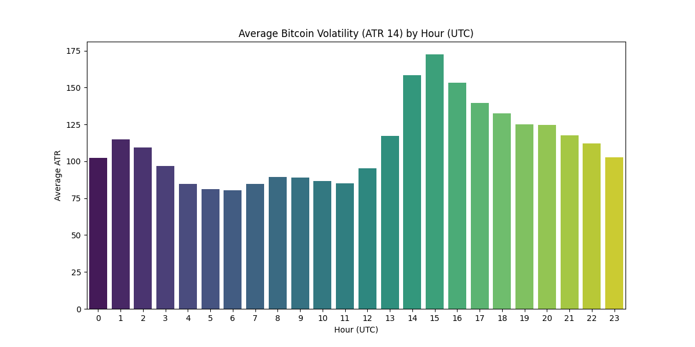
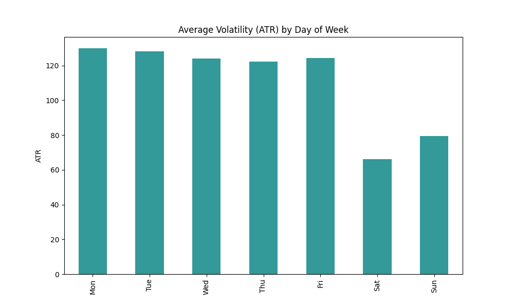

# Phân Tích Định Lượng Biến Động Giá Bitcoin
## Time Series Analysis & Market Microstructure

**Học phần**: Phân tích dữ liệu tài chính
**Người thực hiện**: Antigravity AI
**Dữ liệu**: BTC/USDT (Binance)

---

# 1. Mục tiêu & Phương pháp

### Mục tiêu
*   Hiểu rõ hành vi biến động giá Bitcoin theo giờ và phiên giao dịch.
*   Phát hiện các mẫu hình giá (Patterns) và rủi ro tiềm ẩn (Tail Risk).
*   Đề xuất chiến lược giao dịch dựa trên dữ liệu (Data-driven Strategy).

### Phương pháp tiếp cận
1.  **Thống kê mô tả (Descriptive)**: ATR, Log Return, Relative Volume.
2.  **Học máy (Machine Learning)**: K-Means Clustering để gom nhóm mẫu hình giá.
3.  **Định lượng cao cấp (Quantitative)**: Hurst Exponent, VaR, Amihud Illiquidity.

---

# 2. Phân tích Biến động (Volatility)

### Đâu là "Giờ Vàng"?
*   **Biến động mạnh nhất**: `20:00 - 22:00 VN` (Phiên Mỹ mở cửa).
*   **Biến động thấp nhất**: `05:00 - 08:00 VN` (Giao thoa Á-Âu nghỉ).

### Ý nghĩa
> Dòng tiền thông minh (Smart Money) hoạt động mạnh nhất khi thị trường tài chính Mỹ (NYSE/Nasdaq) mở cửa.

---

# 3. So sánh Phiên Giao dịch

| Chỉ số | Phiên Mỹ (New York) | Phiên Việt Nam (Asian) | Nhận xét |
| :--- | :---: | :---: | :--- |
| **ATR (Biến động)** | **141.6** (Cao) | 91.7 (Thấp) | Phiên Mỹ rủi ro gấp 1.5 lần |
| **Relative Volume** | **1.34** | 0.87 | Thanh khoản tập trung phiên Mỹ |
| **Kurtosis (Rủi ro đuôi)** | **21.9** | 31.8 | Cả 2 đều có rủi ro sập bất ngờ |

**Kết luận**: 
*   **Trader**: Đánh phiên Mỹ (Lợi nhuận cao/Rủi ro cao).
*   **Holder/On-ramp**: Mua phiên Á (Giá ổn định, Spread thấp).

---

# 4. Hiệu ứng Ngày trong Tuần (Seasonality)

*   **Thứ 7 & Chủ Nhật**: Thanh khoản và biến động giảm sâu (~40% so với ngày thường).
*   **Chiến lược**: Tránh đánh Breakout cuối tuần (Dễ gặp Fakeout).

---

# 5. Cấu trúc Vi mô & Mẫu hình

### Clustering Mẫu hình Giá (K-Means)
Chúng tôi tìm thấy 4 loại hành vi chính trong khung 1H:
1.  **Trend Up**: Tăng dốc đứng.
2.  **Trend Down**: Xả hàng mạnh.
3.  **Sideway**: Đi ngang biên độ hẹp (Chiếm 60% thời gian phiên Á).
4.  **V-Shape**: Quét thanh khoản 2 đầu (Kill Long/Short).

---

# 6. Chỉ số Định lượng Cao cấp (Senior Metrics)

### 1. Trạng thái Thị trường (Hurst Exponent)
*   **$H \approx 0.49$** (Gần 0.5)
*   **Ý nghĩa**: Thị trường đang ở trạng thái **Random Walk / Mean Reversion**.
*   **Hành động**: Không nên kỳ vọng xu hướng dài hạn lúc này. Đánh ngắn (Scalping) hiệu quả hơn Hold.

### 2. Quản trị Rủi ro (VaR 99%)
*   **VaR 5 phút**: `-0.3%`
*   **Giải thích**: Cứ 100 cây nến 5m thì có 1 cây giảm mạnh hơn 0.3%.
*   **Khuyến nghị Leverage**: Tối đa **x20** để chịu đựng được các cú quét này.

---

# 7. Kết luận & Đề xuất

1.  **Thời gian**: Chỉ giao dịch tích cực từ **20:00 - 23:00 VN**. Nghỉ ngơi vào cuối tuần.
2.  **Chiến lược**: Ưu tiên **Mean Reversion** (Mua hỗ trợ/Bán kháng cự) do Hurst Exponent thấp.
3.  **Cảnh báo**: Tuyệt đối cẩn trọng với các lệnh Short vào giờ mở cửa Mỹ vì Relative Volume tăng đột biến thường dẫn đến Short Squeeze.

---

# Q&A
## Cám ơn Thầy/Cô và các bạn đã lắng nghe!

*Dữ liệu và biểu đồ được trích xuất tự động từ hệ thống phân tích Python.*
