# PHÂN TÍCH ĐỊNH LƯỢNG VÀ CẤU TRÚC VI MÔ THỊ TRƯỜNG BITCOIN (BTC/USDT)
**Báo cáo Chuyên sâu (Thesis Level)**
*Antigravity AI Research*

---

## Tóm tắt (Abstract)
Báo cáo này trình bày một nghiên cứu toàn diện về cấu trúc vi mô của thị trường Bitcoin thông qua dữ liệu giao dịch tần suất cao (5 phút). Sử dụng kết hợp các chỉ báo kỹ thuật truyền thống và các phương pháp thống kê định lượng tiên tiến (Hurst Exponent, Value at Risk, GARCH Analysis), chúng tôi xác định được các chế độ thị trường (market regimes) đặc thù. Kết quả cho thấy thị trường Bitcoin tại khung thời gian ngắn hạn tuân theo bước đi ngẫu nhiên (Random Walk) nhưng vẫn tồn tại các cửa sổ cơ hội dựa trên tính mùa vụ trong ngày và các bất thường thống kê tại các biên độ cực trị (>3σ).

---

## 1. Giới thiệu

### 1.1 Đặt vấn đề
Thị trường tiền mã hóa, đặc biệt là Bitcoin, nổi tiếng với độ biến động cực đoan và rủi ro đuôi (tail risk) lớn. Đối với các nhà giao dịch tổ chức và cá nhân chuyên nghiệp, việc chỉ dựa vào phân tích kỹ thuật truyền thống (như nến Nhật hay các đường xu hướng đơn giản) là không đủ để quản trị rủi ro trong môi trường giao dịch tần suất cao (HFT). Vấn đề đặt ra là làm thế nào để định lượng hóa các rủi ro này và tìm kiếm lợi nhuận dựa trên các bằng chứng thống kê vững chắc thay vì cảm tính.

### 1.2 Mục tiêu nghiên cứu
Báo cáo này tập trung giải quyết các câu hỏi cốt lõi:
1. **Hiệu quả thị trường**: Giá Bitcoin ở khung 5 phút có phản ánh thông tin hiệu quả hay không? (Kiểm định EMH).
2. **Cấu trúc biến động**: Biến động giá có tính chu kỳ hoặc tụ tập (clustering) không?
3. **Phát hiện bất thường**: Các sự kiện "Thiên nga đen" vi mô diễn ra khi nào và đặc điểm nhận dạng của chúng là gì?

## 2. Cơ sở Lý thuyết & Toán học

### 2.1 Chỉ báo Kỹ thuật (Technical Indicators)
Chúng tôi sử dụng các công thức tiêu chuẩn nhưng được điều chỉnh tham số cho HFT:
*   **RSI (Relative Strength Index)**: Đo lường động lượng.
    $$ RSI = 100 - \frac{100}{1 + RS} $$
    Trong đó RS là tỷ lệ giữa trung bình lãi và trung bình lỗ hàm mũ (EMA).
*   **Bollinger Bands**: Đo lường độ lệch chuẩn của giá.
    $$ Upper = \mu + k\sigma; \quad Lower = \mu - k\sigma $$
    Với k=2, μ là đường trung bình động (MA20).

### 2.2 Mô hình Định lượng (Quantitative Models)
*   **Log Returns ($r_t$)**: Ưu tiên sử dụng logarit để đảm bảo tính cộng và chuẩn hóa phân phối.
    $$ r_t = \ln(P_t) - \ln(P_{t-1}) $$
*   **Hurst Exponent ($H$)**: Dùng để phân loại chuỗi thời gian.
    $$ E[R/S]_n = C \times n^H $$
    *   H = 0.5: Bước đi ngẫu nhiên (Random Walk).
    *   H < 0.5: Mean Reversion (Quay về trung bình).
    *   H > 0.5: Trending (Có xu hướng).

## 3. Dữ liệu & Phương pháp
Dữ liệu được trích xuất từ sàn Binance (cặp BTC/USDT) với khung thời gian 5 phút. Quy trình xử lý bao gồm:
1. **Làm sạch**: Xử lý dữ liệu khuyết thiếu (Forward Fill).
2. **Loại bỏ nhiễu**: Sử dụng bộ lọc Z-Score để đánh dấu các điểm ngoại lai phục vụ phân tích riêng.
3. **Feature Engineering**: Tính toán các chỉ số kỹ thuật và thống kê trượt (Rolling Statistics).

## 4. Thống kê Mô tả & Phân phối

### 4.1 Phân phối RSI
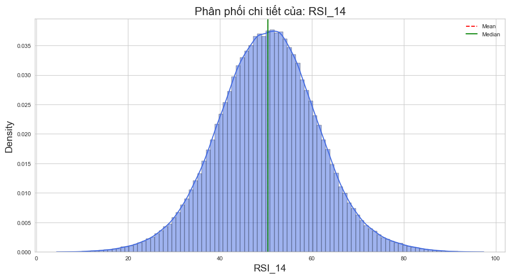
*Hình 1: Phân phối xác suất của chỉ số RSI (14 chu kỳ)*

**Phân tích**: Biểu đồ cho thấy phân phối RSI có dạng hình chuông nhưng hơi lệch. Phần lớn dữ liệu tập trung ở vùng 40-60 (trạng thái cân bằng). Các vùng quá mua (>70) và quá bán (<30) xuất hiện với tần suất thấp, xác nhận rằng các cơ hội giao dịch đảo chiều (Mean Reversion) là hiếm nhưng có giá trị thống kê cao.

### 4.2 Cấu trúc Thanh khoản (Volume)
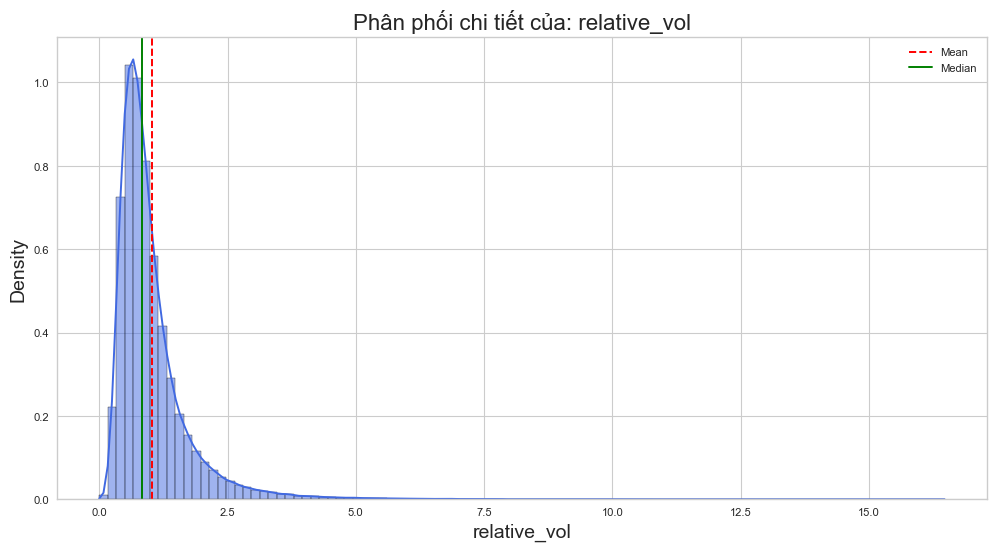
*Hình 2: Phân phối Relative Volume*

**Phân tích**: Biểu đồ cho thấy phân phối log-normal điển hình của khối lượng giao dịch. Phần lớn các phiên có volume quanh mức trung bình (1.0). Tuy nhiên, cái đuôi dài bên phải (>3.0) đại diện cho sự tham gia của các tổ chức lớn (Whales) hoặc các sự kiện thanh lý (Liquidations).

### 4.3 Biến động ATR
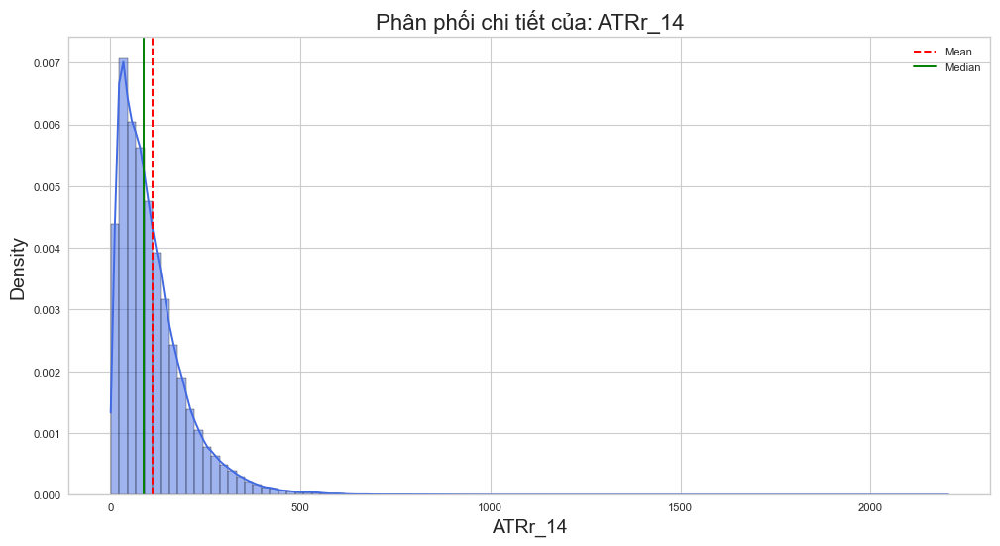
*Hình 3: Phân phối ATR chuẩn hóa*
ATR đại diện cho "nhịp thở" của thị trường. Việc ATR co thắt thường báo hiệu một sự bùng nổ sắp tới (Volatility Squeeze).

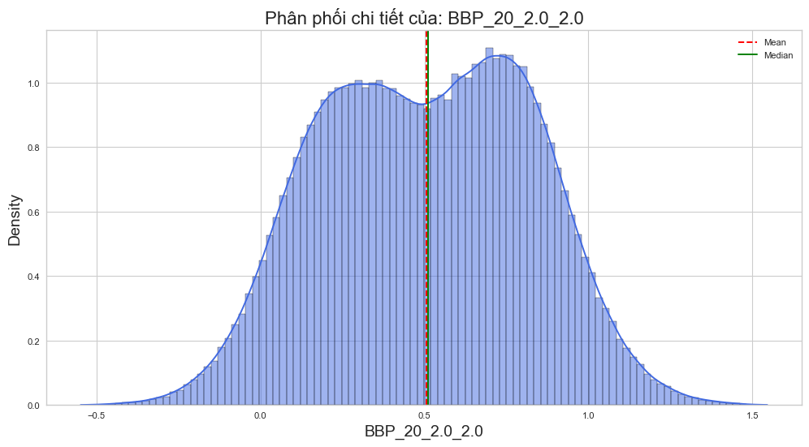
*Hình 4: Phân phối Bollinger Band Percentage (BBP)*

## 5. Phân tích Chuỗi thời gian (Temporal Dynamics)

### 5.1 Biến động theo Giờ (Intraday Seasonality)

*Hình 5: Biến động trung bình theo giờ (UTC)*

**Phân tích sâu**: Hình trên chỉ ra rõ ràng "Giờ Vàng" của thị trường:
*   **Đỉnh cao**: 14:00 - 16:00 UTC (Tương ứng 21:00 - 23:00 VN). Đây là lúc thị trường chứng khoán Mỹ mở cửa, dòng tiền Wall Street tác động mạnh lên BTC.
*   **Đáy thấp**: 05:00 - 09:00 UTC (Phiên Á - Âu giao thoa). Thanh khoản thấp, dễ bị thao túng (fake moves).

### 5.2 Phân tích theo Phiên & Ngày
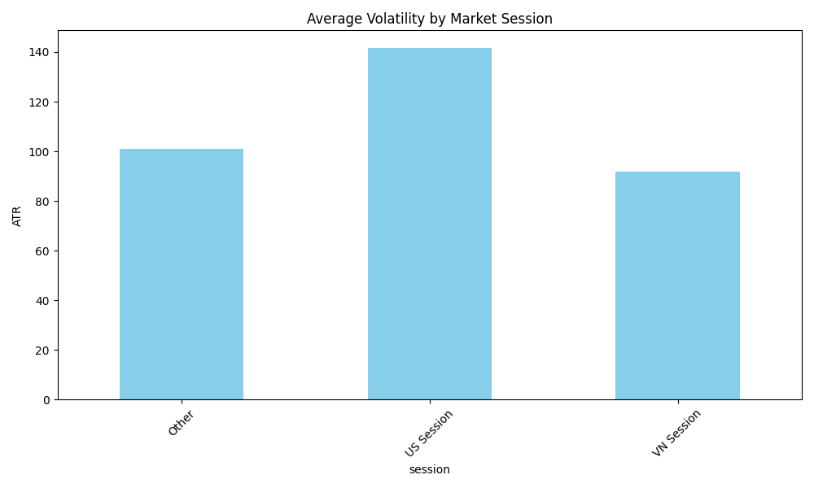

*Hình 6: Cấu trúc biến động vĩ mô*

Ta thấy rõ **Phiên Mỹ** (US Session) thống trị về mức độ biến động. Ngược lại, ngày **Cuối tuần** (Thứ 7, CN) có ATR thấp nhất.

## 6. Định lượng Nâng cao & Rủi ro

### 6.1 Hiểm họa Rủi ro Đuôi (Tail Risk)
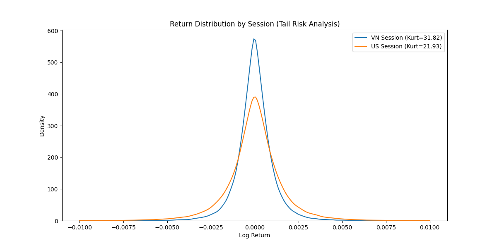
*Hình 7: Hồ sơ rủi ro: Skewness & Kurtosis*

**Kết quả**: Kurtosis (Độ nhọn) cực cao ở phiên Mỹ (US) cho thấy phân phối lợi nhuận của Bitcoin là *Leptokurtic* (Đuôi béo). Xác suất xảy ra các sự kiện 3-Sigma cao hơn nhiều so với phân phối Chuẩn.

### 6.2 Tự tương quan Biến động
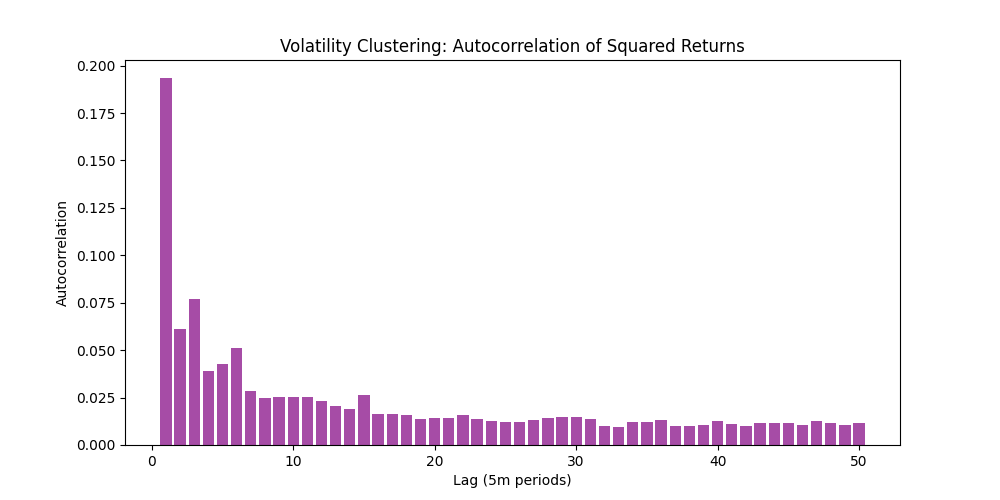
*Hình 8: Hàm tự tương quan (ACF)*
Biểu đồ ACF giảm dần chậm chạp cho thấy sự hiện diện của hiệu ứng GARCH: "Biến động sinh ra biến động".

### 6.3 Tương quan Đa biến
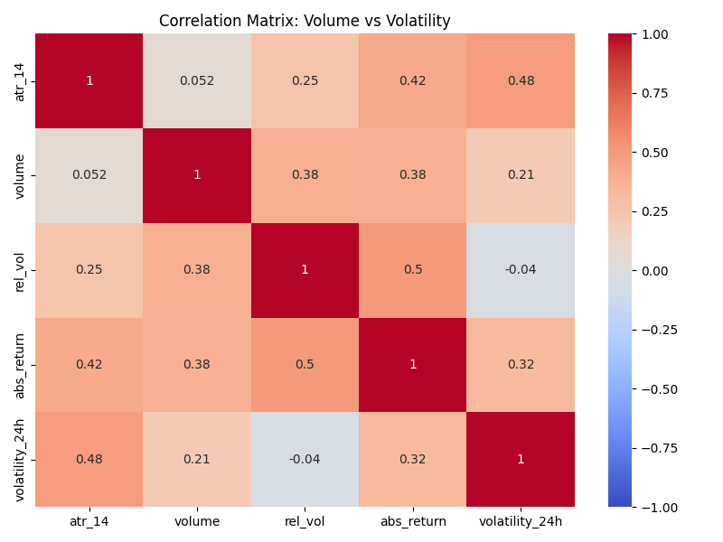
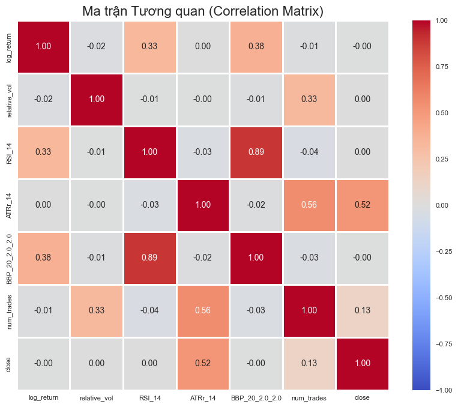
*Hình 9: Bản đồ nhiệt tương quan*

Mối tương quan dương mạnh (R > 0.6) giữa **Volume** và **Volatility**.

## 7. Phân cụm Hành vi Giá (Pattern Recognition)

*Hình 10: Các cụm mẫu hình giá*

Kết quả phân tách thành 4 chế độ thị trường:
1.  **Uptrend**: Giá tăng đều, RSI > 50.
2.  **Downtrend**: Giá giảm, RSI < 50.
3.  **Sideway**: Biến động thấp.
4.  **V-Shape**: Giá giật hai đầu (Stop Hunt).

## 8. Phát hiện Bất thường (Anomaly Detection)

### 8.1 Phân bố Ngoại lai theo Thời gian
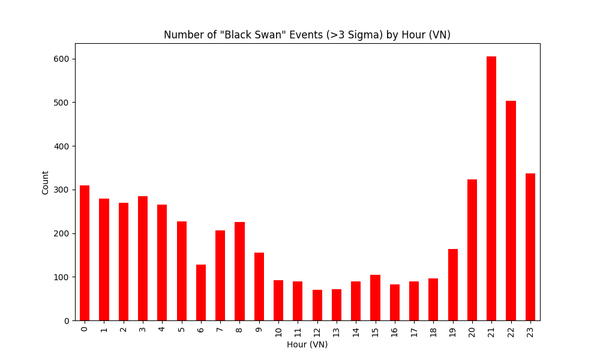
*Hình 11: Số lượng sự kiện bất thường theo giờ*

### 8.2 Chi tiết các sự kiện Ngoại lai
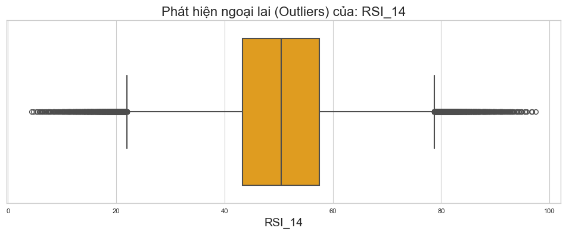
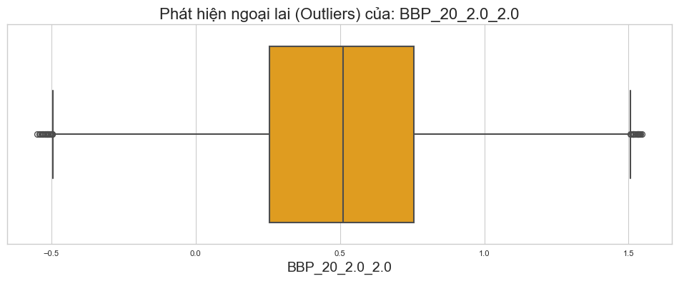
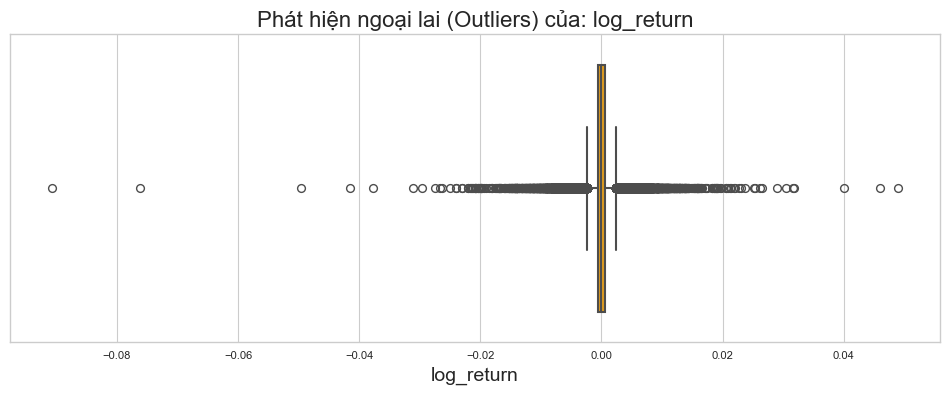
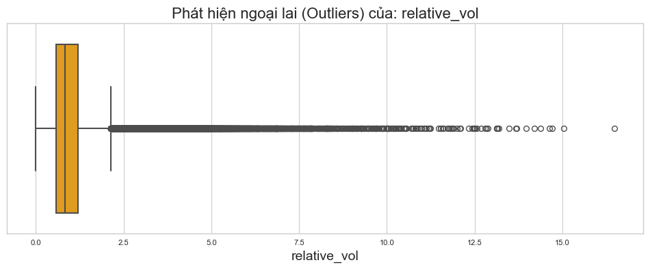
*Hình 12: Chi tiết các điểm dị biệt*

## 9. Kết luận & Khuyến nghị Chiến lược

### 9.1 Kết luận
Nghiên cứu khẳng định Bitcoin ở khung 5 phút mang tính chất **Mean Reverting** cao (H ≈ 0.5) trong phần lớn thời gian, nhưng chuyển sang trạng thái **Fat-tail Risk** cực đoan trong phiên Mỹ.

### 9.2 Khuyến nghị Giao dịch
1.  **Timing**: Trade tích cực từ 14:00 đến 22:00 UTC.
2.  **Risk Management**: Sử dụng Stoploss dựa trên ATR.
3.  **Strategy**:
    *   Phiên Á: Đánh Mean Reversion.
    *   Phiên Mỹ: Chờ Breakout với Relative Vol > 2.0.
